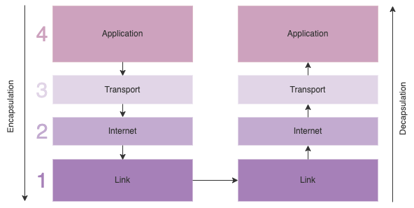

Have you ever wondered what happens when you search for a url in a browser? How are you able to see the information of a particular url you enter into the browsers search bar? Below are the steps fron pressing 'enter' to seeing the page.

## Find the IP address for the URL

A URL is used to access a particular web page. The web page will be stored on a server which can be identified by an IP address which is made up of a series of numbers.

Firstly, the browser needs to find the IP address matching the URL, this can be done via DNS (Domain Name System) which translates the URL into an IP address.

The browser will look in several places to see if the DNS has been cached before searching further.
A DNS cache is stored in the browser, the OS, and the router / local network cache. These caches are important for regulating network traffic and improving data transfer times.

If the IP address is not found in any of the caches, the request is then sent the the ISP (Internet Service Provider) DNS servers in the form of a DNS query. The server will check its database of DNS records. If the query is found, then an authorititve answer is sent back to the browser.

If it is not found, then the ISP DNS server will check its cache to see if the DNS record is there, otherwise it will use recursion to query other authoratitive servers that are listed in its root hint file.

## HTTP Request

The browser will prepare a request for the web page using HTTP. HTTP (Hypertext Transfer Protocol) is an application layer protocol that works in a request-response model between a client (your computer) and the server where the website information is.

The browser will request information from the server through various HTTP methods such as a GET request.

## TCP/IP

The browser will send that request by buidling a connection with the server identified by its IP address, and transfer the information. This is done using an internet protocol, TCP is the most common protocol used for HTTP requests.

TCP defines how applications create channels of communication accross a network.

IP defines how to address and route each packet to make sure it reaches the right destination.

The TCP/IP model has four layers, starting with the application layer where the HTTP information is sent to the next layer. Each layer adds its own bit of information which helps to identify the request and send it. This process is called encapsulation.

Once it gets to the last layer - the link layer, which contains the physical parts of the internet - the data is then transmitted to the receiving decive and processed back through the TCP layers in a process called decapsulation.

The connection of the client to the server is done via a TCP/IP three way handshake or Positive Acknowledgement with Re-transmission(PAR). In this process he client and server sycronises (SYN) and acknowledges (ACK) the other.

1. **SYN** - the client that wants to establish a connection with the server and sends a segment with SYN (Synchronize Sequence Number), informing the server of the sequence number its segments start with.
2. **SYN + ACK** - the server responds with SYN-ACK signal bits set. ACK part with the segment it recieved and SYN part with the sequence number it starts segments with.
3. **ACK** - the client acknowledges the server response and establishes a reliable connection to start the data transfer.

## HTTP Response

When the web server returns the HTTP response, it will come with various headers such as the status code which - is responsible for highlighting any errors, cache-control, content-encoding and more.

The content will commonly be HTML which the browser will render, fetching any other components of the web page such as images and css along the way.

So there you have it. A web page and its content in front of you in a matter of milliseconds. Everytime you interact with the page in your browser, more HTTP requests are made in the same manner as noted above, which changes the view of the web page that you see through the browser.
